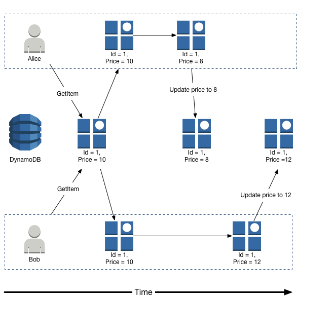
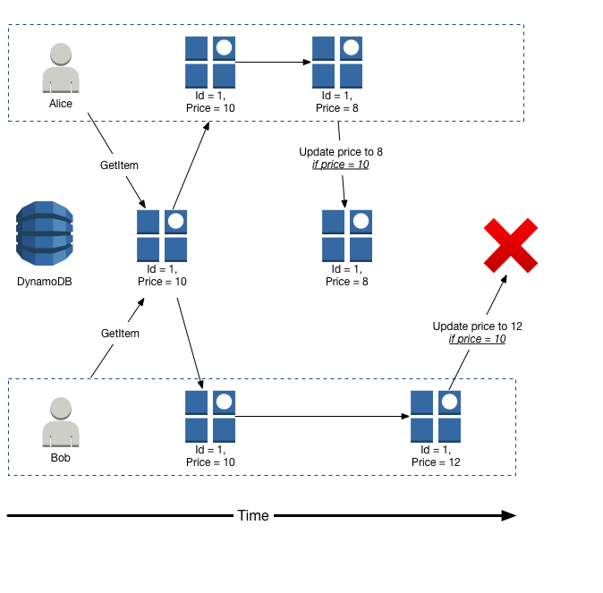
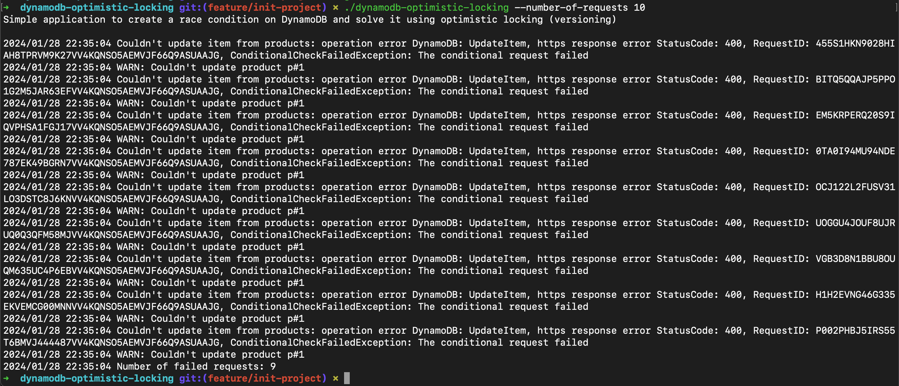

# Dynamodb Optimistic Locking

This is a simple project written in a weekend to 
implement optimistic locking (versioning model) on DynamoDB.

## Problem statement

Assume we have a table called `products` on DynamoDB. One of the attributes is `quantity` showing the number of available products in the wharehouse.

Now assume different users order the same product concurrently,
resulting in race condition. How would you fix this problem?

- Assume that we are not serializing the requests in one
Goroutine (or in one thread, in generic);
each request is handled by one Goroutine concurrently.
- Special edge case of this problem, will be scenario
where we have only 1 product available in the wharehouse;
but 2 users order that exactly at the same time.



## Solution

By default, DynamoDB is not ACID complient. But with a
correct combination of [Transactional Write](https://docs.aws.amazon.com/amazondynamodb/latest/developerguide/transaction-apis.html)
and
[Conditional Write](https://docs.aws.amazon.com/amazondynamodb/latest/developerguide/WorkingWithItems.html#WorkingWithItems.ConditionalUpdate)
we can achieve a similar behavour.

### Architecture

One of the easiest ways to solve this problem is
to use [Optimistic Locking](https://en.wikipedia.org/wiki/Optimistic_concurrency_control)
implemented with Conditional Write.

1. To achieve this, we can add a `version` attribute
(with a default value of 1) to the table.
2. All of the requests, get the same item from DynamoDB.
3. Next to the change each request want to do with the item,
they should also bump the `version` by +1. Ex: if the previous
version was 1, it will become 2 locally.
4. All of the threads can now send the update request; with
the following condition expression: `version = oldVersion`.
    - Only request for one of the threads will be accepted
and every other request will be rejected as the version is
updated and is not equal to the old value.

A picture is worth a thousand words:


## How to run the project

### Creating the table

Make sure you have [Terraform](https://www.terraform.io/) installed.
Then easily create the table using:

```hcl
cd infra/
terraform init
terraform apply
```

**Note:** Make sure your IAM role has the correct permissions
to create DynamoDB table and has read/write access on that table.

### Running the application

First thing first, build the application:

```go
go mod tidy
go build
```

Then to populate the table, you can easily provide the
`--populate-table` so the script will populate the table
with sample data for you:

```sh
./dynamodb-optimistic-locking --populate-table
```

**Note:** You can skip this part if you don't want to populate
the table with sample data.

and to run the application:

```sh
./dynamodb-optimistic-locking --number-of-requests 100
```

This will simulate submitting 100 orders simultaneously, which
if everything goes well, 99 of them should fail:
